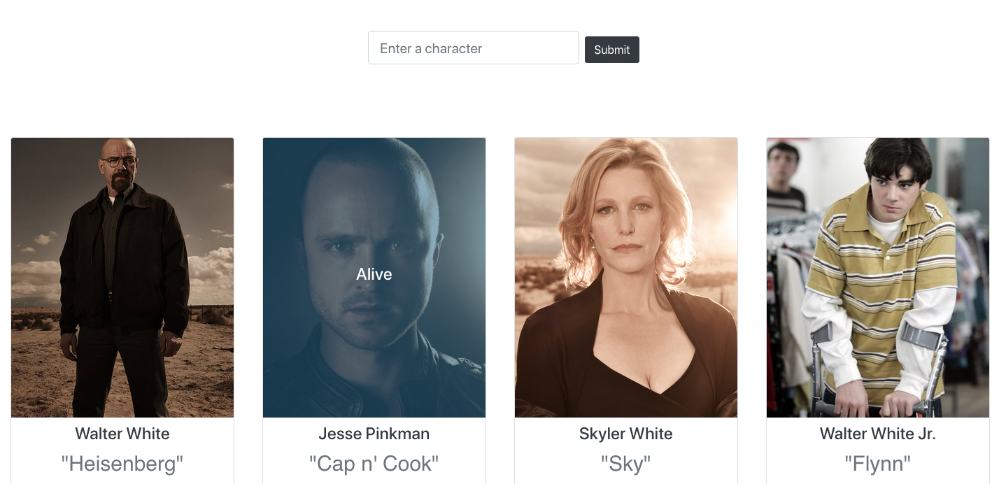

# Breaking Stats

---



### Overview

React application that displays information about characters from the TV show 'Breaking Bad'. Browze or search for characters from the BB universe, hover over a character card to view their status.
API from https://breakingbadapi.com/

### Objectives

To gain a deeper understanding of creating and testing custom react hooks.

### How to install

- Clone or download repo
- Switch to the project directory and run..

```
npm install
```

```
npm start
```
